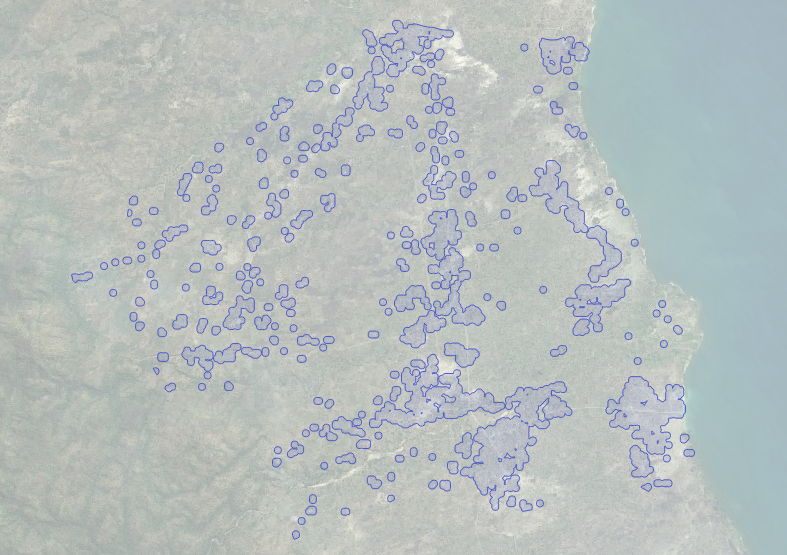

# FacebookTaskGenerator

These script can be used to transform High Resolution Settlement Layer (HRSL)
"Facebook" data into polygons for creating HOTOSM tasks to map buildings.

Information and data about the HRSL project can be found here: 
[https://ciesin.columbia.edu/data/hrsl/](https://ciesin.columbia.edu/data/hrsl/)

## Process

Unfortunately I did not manage to convert the data using just one system or
programming language. So to run the entire conversion there are a few steps:

* Download the hrsl geotiff and an admin shapefile
* Clip hrsl raster into smaller rasters by admin areas
* Polygonize smaller rasters into shapefiles
* Load shapefiles into PostgreSQL database
* Buffer, union and intersect data

The result is a PostgreSQL table containing 40m buffered polygons of the cells
marked by HRSL as "containing buildings". The `pcode` field contains a unique
value for the admin area the polygons belongs to. The `name` field contains the
real name of the admin area.

## Data

This is an example for Malawi. 

### Download and extract the folowing data:

HRSL:
[https://ciesin.columbia.edu/data/hrsl/hrsl_mwi_v1.zip](https://ciesin.columbia.edu/data/hrsl/hrsl_mwi_v1.zip)
 
Administrative areas:
[https://data.humdata.org/dataset/malawi-admin-level-3-boundaries](https://data.humdata.org/dataset/malawi-admin-level-3-boundaries)

### Download or clone this git repository

