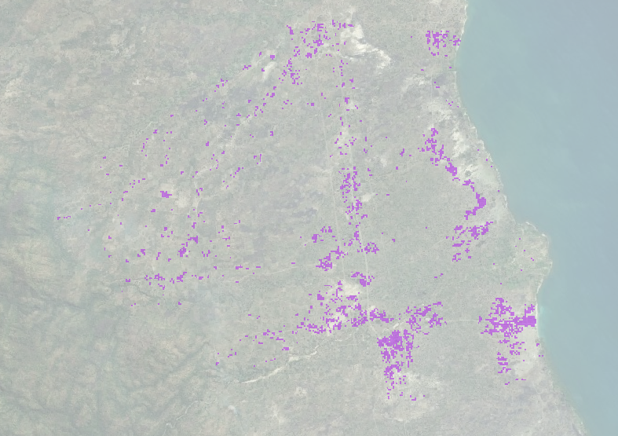

# FacebookTaskGenerator

These script can be used to transform High Resolution Settlement Layer (HRSL) "Facebook" data into polygons for 
creating HOTOSM tasks to map buildings.

Information and data about the HRSL project can be found here: 
[https://ciesin.columbia.edu/data/hrsl/](https://ciesin.columbia.edu/data/hrsl/)

Process

Unfortunately I did not manage to convert the data using just one system or
programming language. So to run the entire conversion there are a few steps:

-Download the hrsl geotiff and an admin shapefile.

